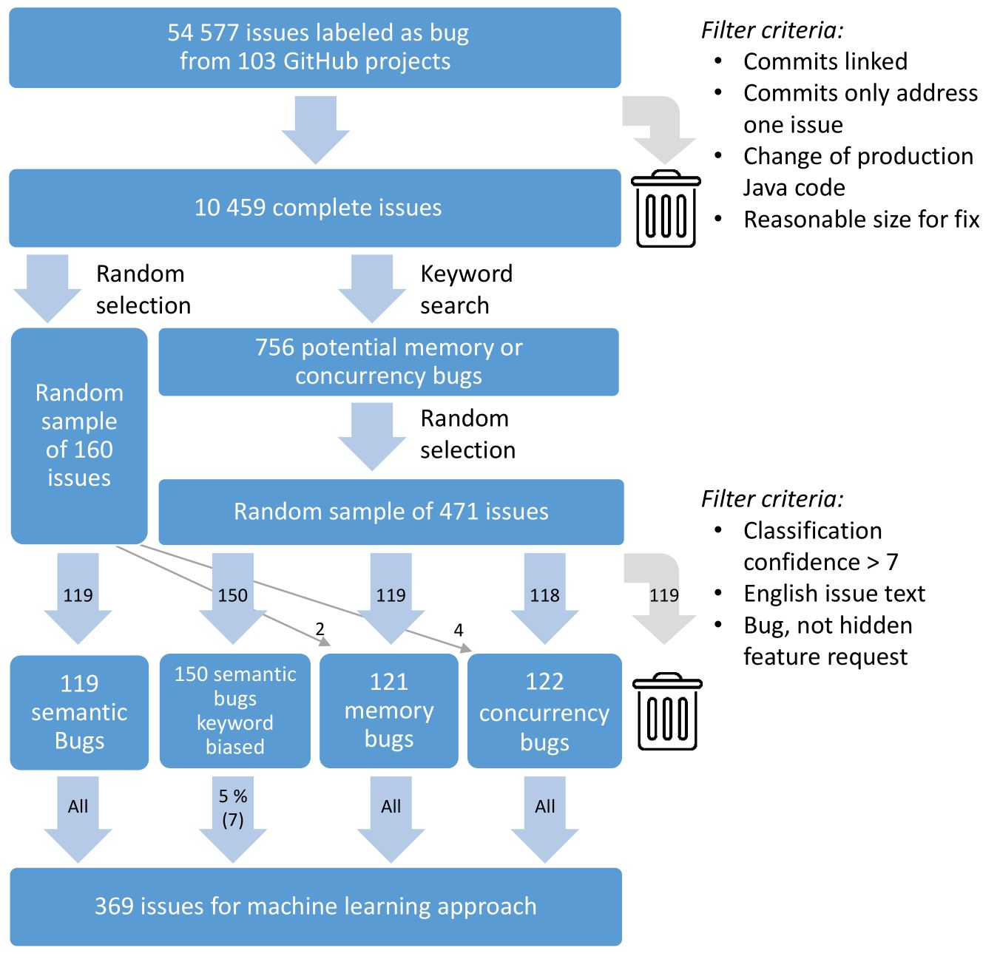

# AmadeusGitHubBugDataset
This repo contains everything required to reproduce what is described in "Root cause prediction based on bug reports" by T. Hirsch and B. Hofer,
including the full data set, all code for data set creation and automated ML bug classification.
As our work is ongoing this data set is subject to change.

## The data set
The full data set consists of 54755 "bug" labeled issues reports collected from 103 open source projects hosted on Github.
From these, 10459 issues are used based on filter criteria described in "Root cause prediction based on bug reports" (commits available, changes in production java code, only dealing with a single issue, less than 10 commits, max. 20 files changed per commit, max. 250 LOC changed per file).

These 10459 issues are considered "benchmark ready", and they contain: issue message, commit messages, java aware diff statistics, change location down to method level, github issue metadata, and commit metadata.

A training set for ML experiments consisting of 126 semantic bugs, 121 memory bugs, and 122 concurrency bugs was created from this benchmark by manual investigation. (see details below)



This data set can be used for natural language processing (NLP) experiments and as benchmark for information retrieval (IR) based fault localization approaches. 

### Using the data set:
Create a python script, or console and run the following:
```python
from pandasMagic import BugDataFrames, Filters
df = BugDataFrames.get_all_issues_df() # loads all available issues (including PRs, without commits, etc) - 54755 issues
df = Filters.remove_pull_request_issues(df) # remove all PRs
df = Filters.only_bugs_with_valid_commit_set(df)  # filter for issues where fixes are available - 10459 issues
```
Have a look at [RUN_example_load_dataset.py](RUN_example_load_dataset.py) for an example.

## Machine learning experiment
Automated classification of bug types based on machine learning and NLP.
A training set was created from above described benchmark, using keyword search on commit message combined with random selection followed by manual examination of those bugs. (for details please have a look at "Root cause prediction based on bug reports")
The training set consists of 122 concurrency bugs, 121 memory bugs, and 126 semantic bugs.
This training set is expected to grow and change as our work continues.

### Plots and Performance reports:
Plots for all individual experiment runs, as well as textual information on performance and selected hyperparameters can be found here: [mlClassifier/figures](mlClassifier/figures).

### Training data
The training set can be found in [mlClassifier/data](mlClassifier/data).

### Running the experiment
To start the experiment, run the following script: [RUN_ml_experiment.py](RUN_ml_experiment.py) (this will run the experiment 10 times, this can be changed in line 81 in main())

### Creating your own training set
Create your own manual classification or mapping in a csv, and modify the training set creation in [mlClassifier/InputDataCreator.py](mlClassifier/InputDataCreator.py) accordingly.
Remove the existing training set in [mlClassifier/data](mlClassifier/data).

Run this script: [RUN_create_trainingset.py](RUN_create_trainingset.py).

## Extending the data set
### File locations
Collected issue tickets for all projects can be found in [githubanalysis/data](githubanalysis/data).

### File structure
Please have a look at [exampleIssue.json](exampleIssue.json) for an example on the structure of the data set files.

### Extending the data set 
Download the newest version of the gumtree-spoon-ast-diff jar library here:
[https://github.com/SpoonLabs/gumtree-spoon-ast-diff](https://github.com/SpoonLabs/gumtree-spoon-ast-diff).

Update the [config.json](config.json) file with your Java SDK location, the path to the spoon library, and a GitHub API key.
Creating a GitHub API key and adding it to the config files is strongly recommended.

The list of GitHub projects are stored in the CONFIG_PATHS field in [common/constants.py](common/constants.py).

To re-build the full data set run [RUN_build_dataset.py](RUN_build_dataset.py) (be aware this will take a long time, create quite some traffic, and will overwrite the existing data set).

To add new projects, create config files in [githubanalysis/data](githubanalysis/data).

Modify line 15 in [RUN_build_dataset.py](RUN_build_dataset.py) to include only new config paths, and then run the script. 

Finally, add the new configs to the CONFIG_PATHS to use them in keyword search and ML experiments.

## Python requirements

### Conda
The conda environment can be found in [conda.yml](conda.yml).

### Python 3.5+

* Cython
* GitPython
* PyGithub
* matplotlib
* numpy
* packaging
* pandas
* pyjnius
* tabulate
* beautifulsoup4
* google-api-core
* google-api-python-client
* google-auth
* google-auth-oauthlib
* gspread
* oauth2client
* oauthlib
* plotly
* psutil
* scikit-learn
* scipy
* nltk

## Other scripts and structure of this repo

* [githubanalysis/githubIssueAquisition](githubanalysis/githubIssueAquisition) - Contains everything for fetching issues from GitHub.
* [githubanalysis/codeAnalysis](githubanalysis/codeAnalysis) - Contains Java aware differ.
* [githubanalysis/gitRepoAnalysis](githubanalysis/gitRepoAnalysis) - Contains all code for performing operations on local git repos.
* [githubanalysis/data](githubanalysis/data) - The data and config files for all projects.
* [githubanalysis/db](githubanalysis/db) - Scripts for creating the code stats and other metadata based on fetched issues.

* [RUN_search_keywords.py](RUN_search_keywords.py) and [keywordSearch](keywordSearch) - For performing searches on various text corpuses in the dataset.

* [mlClassifier](mlClassifier) - The training set, scripts for creation them, as well as ouptut folder for the experiments.

* [pandasMagic](pandasMagic) - Scripts for combining the raw data of all fetched projects, and applying filters to them.

## Acknowledgement
The work has been funded by the Austrian Science Fund (FWF): P 32653 (Automated Debugging in Use).
